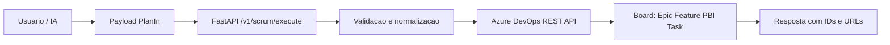

# Arquitetura

## Componentes

- **API Gateway (`server.py`)**
  - Expõe `GET /health` e `POST /v1/scrum/execute`.
  - Valida API key de entrada.
  - Orquestra criação de Work Items no Azure DevOps.

- **CLI Operacional**
  - `create_epic.py`: criação unitária.
  - `create_scrum_tree.py`: criação hierárquica e em lote.

- **Integração Azure DevOps**
  - REST API `wit/workitems`.
  - Autenticação via PAT.
  - Links hierárquicos via `System.LinkTypes.Hierarchy-Reverse`.

- **Documentação e Prompting**
  - Guias API-first para geração de payload.
  - Prompt dedicado para Custom GPT.

## Diagrama lógico

## Decisões arquiteturais

- Contrato único de entrada (`PlanIn`) para API/IA.
- Critérios de aceite por nível.
- Fallback para `Description` quando `AcceptanceCriteria` não existe.
- Formato markdown para campos multilinha.
